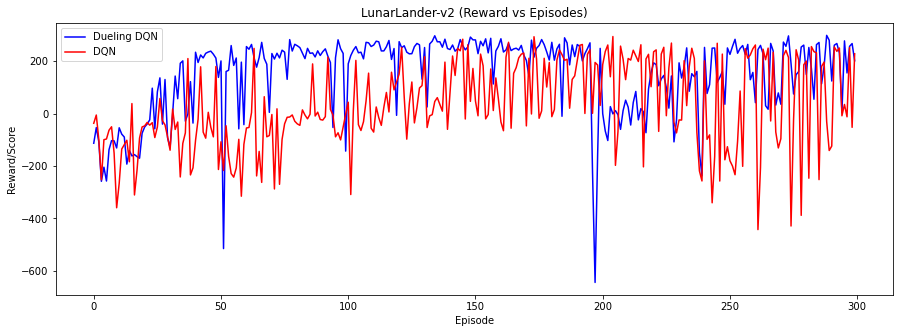
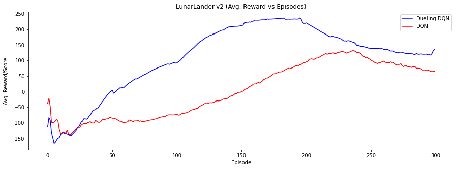

# Reinforcement Learning Deep Q-Neural Networks to play videogames

For this project, I trained and compared the performance of two Reinforcement Learning algorithms, namely, Deep Q-Neural Networks and Dueling Deep Q-Networks.

## Deep Q-Networks (DQN) model training

The Lunar Lander gives 8 parameters as input and has 4 possible actions.

The DQN model was deployed in PyTorch. It makes use of two fully connected layers with 256 neurons in each layer. The epsilon value was initialized as <code>1</code> and bounded to be at least <code>0.01</code>, gamma was set to <code>0.99</code>, the learning rate at <code>0.001</code>, the batch size as <code>64</code>, and the epsilon decay rate as <code>0.0005</code>.

It ran through 300 episodes

## Dueling Deep Q-Networks (Dueling DQN) model training

The Dueling DQN model was deployed in PyTorch. It makes use of two fully connected layers with 256 neurons in each layer. The epsilon value was initialized as <code>1</code> and bounded to be at least <code>0.01</code>, gamma was set to <code>0.99</code>, the alpha at <code>0.0005</code>, the batch size as <code>64</code>, and the epsilon decay rate as <code>0.001</code>.

It ran through 300 episodes as well

# DQN vs Double DQN

In Figure 1, one can observe the difference in performance between these two models, the Y-axis shows the score at an episode x. In general, Dueling DQN reaches its peak earlier than DQN.

However, around episode 200, Dueling DQN's performance drops and then recovers again at around episode 250.

Also, DQN reaches its peaks at around episode 150, but it drops after about episode 230.

By looking at Figure 2, which shows the average score, its clearer that Dueling DQN performs much better than DQN. It not only converges much earlier but it also consistently outperforms DQN.

